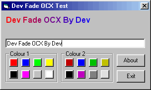



## Fade text control

### Description

Dev Fade is a control which can create faded text on your forms.
 
### More Info
 

             |
---                |---
**Submitted On**   |2000-02-26 10:10:56
**By**             |[dev](https://github.com/Planet-Source-Code/PSCIndex/blob/master/ByAuthor/dev.md)
**Level**          |Intermediate
**User Rating**    |5.0 (10 globes from 2 users)
**Compatibility**  |VB 5\.0, VB 6\.0
**Category**       |[Custom Controls/ Forms/  Menus](https://github.com/Planet-Source-Code/PSCIndex/blob/master/ByCategory/custom-controls-forms-menus__1-4.md)
**World**          |[Visual Basic](https://github.com/Planet-Source-Code/PSCIndex/blob/master/ByWorld/visual-basic.md)
**Archive File**   |[CODE\_UPLOAD36202262000\.zip](https://github.com/Planet-Source-Code/dev-fade-text-control__1-6273/archive/master.zip)

